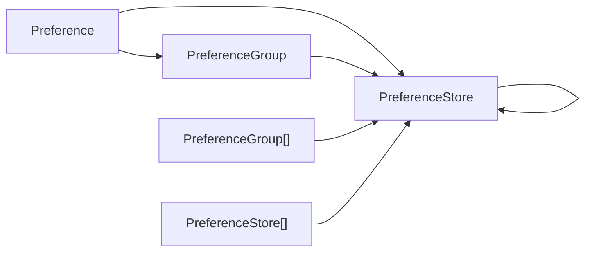
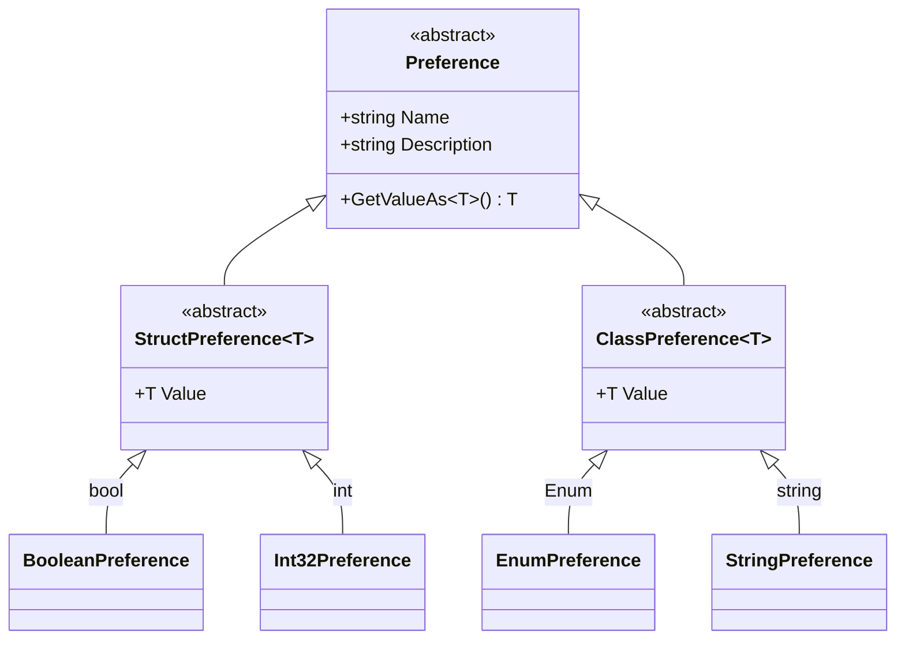

# PreferenceGroups

The `PreferenceGroups` package is a library for user preferences, organized by groups of primitive types, with metadata like a description of the preference and utilizes a file store using the [JSON with comments file format](https://jsonc.org/) (the `*.jsonc` file extension). The motivation is to better encapsulate preferences so from the developer implementing them, to the user being presented with them, and to the file store with comments, the context is preserved throughout.

## Usage

A basic `PreferenceGroup` could be instantiated with:

```csharp
using PreferenceGroups;

PreferenceGroup group = PreferenceGroupBuilder
    .Create()
    .AddInt32(name: "Number", b => b
        .WithDefaultValue(13))
    .AddString(name: "String", b => b
        .WithDescription("A string prefence."))
    .Build();

PreferenceFile file = new(path: "Preferences.jsonc",
    indentChar: ' ', indentDepth: 2);

// Writes group to the file, overwriting it if exists.
file.Write(group);

// Updates group according to the contents of the file.
file.Update(group);
```

The contents of the `Preferences.jsonc` file will be:

```jsonc
{
  // Default value: 13.
  "Number": null,

  // A string prefence.
  "String": null
}
```

## Structure

A `Preference` is the the basic unit of the library and it has an associated `Name` and `Value`, along with some additional metadata like what the `DefaultValue` is. A `PreferenceGroup` is a dictionary of `Preference`s where the key is the `Name` of the preference. A `PreferenceStore` is a generic dictionary of `PreferenceStoreItem`s, where a `PreferenceStoreItem` can be a `Preference`, `PreferenceGroup`, `PreferenceStore`, an array of `PreferenceGroup`, or an array of `PreferenceStore`. This allows for a `PreferenceGroup` to be used in plugin architectures, such that a plugin developer could define a group in a structured way and understand the behavior that group will be implemented to the user. Different groups could be provided for expected plugins to provide. 

The following diagram shows the structure of this package:



The behavior of a `Preference` `Value` is for it to be `null` when it has yet to be set. For value types, like `System.Int32`, the `Nullable<T>` class is used to box set values and allow for the `null` behavior. To implement this behavior, the approach was taken to split implementations between the `StructPreference<T> : Preference where T : struct` and `ClassPreference<T> : Preference where T : class` for the value types used in the implementation.

The following diagram shows an abbreviated inheritance structure of the `Preference` class and the implementations:



## Supported Types

A `Preference` can have a `Value` of the following `Type` using the corresponding implementation:

| C# Keyword, if any | `Type`                 | `Preference` Implementation |
| :----------------: | :--------------------: | :-------------------------: |
| `bool`             | `System.Boolean`       | `BooleanPreference`         |
| `sbyte`            | `System.SBytes`        | `SBytePreference`           |
| `byte`             | `System.Byte`          | `BytePreference`            |
| `short`            | `System.Int16`         | `Int16Preference`           |
| `ushrot`           | `System.UInt16`        | `UInt16Preference`          |
| `int`              | `System.Int32`         | `Int32Preference`           |
| `uint`             | `System.UInt32`        | `UInt32Preference`          |
| `long`             | `System.Int64`         | `Int64Preference`           |
| `ulong`            | `System.UInt64`        | `UInt64Preference`          |
| `float`            | `System.Single`        | `SinglePreference`          |
| `double`           | `System.Double`        | `DoublePreference`          |
| `decimal`          | `System.Decimal`       | `DecimalPreference`         |
| `enum`             | `System.Enum`          | `EnumPreference`[^1]        |
| `string`           | `System.String`        | `StringPreference`          |
| `byte[]`           | `System.Byte[]`        | `BytesPreference`           |
| _N/A_              | `System.Net.IPAddress` | `IPAddressPreference`       |

[^1]: The `EnumPreference` uses the `System.Enum` for the `Value` container to allow for runtime instantiation (see the `PreferenceGroupBuilder.BuildFrom(object, bool, bool)` method). Use the `Preference.GetValueAs<T>()` method and similar methods to retrieve the `Value` with the original `enum`. This is generally the best way for any `Preference`, but the others can be cast to their implementation and then access the `Value` directly. Also, when needing to build in code, it is best to use `EnumPreferenceBuilder<T>`, instead of `EnumPreferenceBuilder`, since the former provides better type checking at compile time. This is consistent with the uses in `PreferenceGroupBuilder` and `PreferenceStoreBuilder`, which use the `EnumPreferenceBuilder<T>`.
